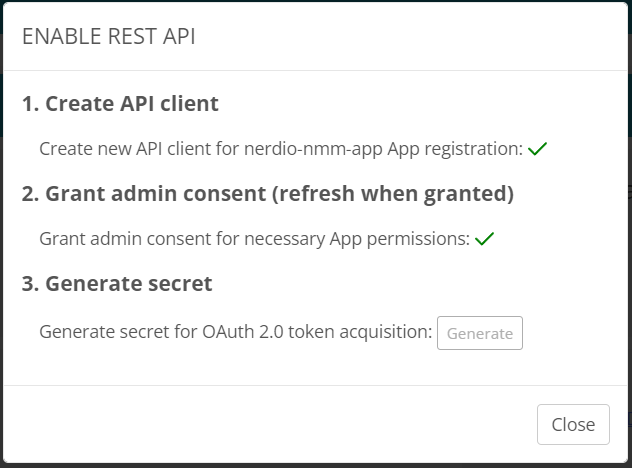

# NMMAPI - A PowerShell Module for NMM (Nerdio Manager for MSP)


## About NMMAPI

The NMMAPI PowerShell module is a collection of cmdlets built to interact with the [Nerdio Manager for MSP](https://getnerdio.com/nerdio-manager-for-msp/) REST API.

***

## Installation

This module can be installed from the PowerShell Gallery with the following command in PowerShell 5.1+

```powershell
Install-Module -Name NMMAPI
```

After installation, load the module into your PowerShell session:

```powershell
Import-Module -Name NMMAPI
```

## Keeping NMMAPI up to date

You can update your module to the latest available release on PowerShell Gallery by running the following command;

```powershell
Update-Module -Name NMMAPI
```

Alternatively, you can download the module via this Github repository and drop the module folder into your PowerShell modules directory.

***

## Enabling the REST API in NMM

* First, ensure that your NMM installation configuration has the `REST API` enabled.
* Browse to your NMM installation, navigate to `Settings` and then to `Integrations` - the `REST API` section will have a `Current Status: Disabled` field.<!--   -->
* Click on `Disabled`, and the `Enable REST API` dialog will open. The first step will be to create the `API client` - click on the `Run` button, it will take a few seconds to generate the client.<!--  -->
* Next, grant `Admin Consent` by clicking on the `Grant` button - a new window will pop up with the `NMM App Registration` in the Azure portal. You will need to click the `Grant consent for <tenant>` button, and then click `Yes` in the dialog to confirm consent.<!--  -->
* Once complete, navigate back to the `NMM` tab and hit the refresh icon next to the `Grant` button.<!--  -->
* Now we generate the `Client Secret`, by clicking the `Generate` button.<!--  -->
* You will now be presented with all the critical information needed to connect to the `NMM REST API`.<!--  -->

    >Be sure to secure your `Client Secret`, it will not be displayed again. However it can be regenerated at any time.

***

## Setting up the module

* After a successful import of the module, run the following command:

```powershell
Add-NMMCredentials
```

* You will be prompted to enter your `NMM URL`, `OAuth 2.0 token`, `M365 Tenant ID`, `NMM Client ID`, `NMM Application Scope` and your `NMM Application Secret` that were created during the enablement of the `REST API` - if you need to retrieve the settings again, they are available on the `Settings -> Integration` page of your NMM installation.
* After adding your NMM credentials, the cmdlet will attempt to get a response from the `/rest-api/v1/test` endpoint, and respond with a success or failure.
* For frequent use and portability, there is the `Export-NMMCredentials` and `Import-NMMCredentials` cmdlets that will save your settings to `C:\Users\<username>\NMMAPI\nmmConfig.json` for later use.
    >You should treat this file with the importance it deserves, it is your API key!

***

## Using the module

* Once `Add-NMMCredentials` has been executed, and you've received a confirmation that the test API endpoint was able to be reached, we're ready to go!
* Run `Get-NMMCustomers` to get a list of accounts that are configured in your NMM installation;
  * From here, you can see your organizations, organized by `ID` and by `Name`.
  * `ID` is key, as that will be used to identify which customer account(s) are being targeted by almost all cmdlets that are included in this module.

><details>
><summary>This module follows standard PowerShell naming conventions, and in general each action is named appropriately for the task it is intended to perform, expand me for more information on the action/verb structure!</summary>
>
>**REST API Action**|**PowerShell Verb**
>:-----:|:-----:
>GET|Get-
>DELETE|Remove-
>PATCH|Set-
>POST|N|Soonew- / Invoke-
>
>For example, the `Secure Variables` MSP level endpoint can have the following actions performed;
>
>```powershell
>Get-NMMSecureVariable
>Remove-NMMSecureVariable
>Set-NMMSecureVariable
>New-NMMSecureVariable
>```
>
></details>  
<br>

### Example - *Setting a secure variable for a customer*

It can be useful to leverage secure variables when you have a scripted action that installs software, or performs other tasks that require a customer-unique variable. This allows you to maintain generalized scripts, and only manage the customer secure variables.

In this example, we are going to take manually specify a variable to be created in a customer account.

First, lets find what customer we'd like to create a secure variable for

```powershell
Get-NMMCustomers | Where-Object name -match "demo"

id name
-- ----
54 Demo Customer
```

We can see that our demo customer has the ID of "54" - so we will reference that ID when using the `New-NMMCustomerSecureVariable` cmdlet.

```powershell
New-NMMCustomerSecureVariable -id 54 -variableName NewVariable -variableValue NewValue

job
---
@{id=187416; status=Completed}
```

Now, if you reference the customer log, you will see the REST API user executed the task "Create secure variable."

But wait, theres more! This cmdlet can do a lot more, for example we can pipe the output of our original `Get-NMMCustomers | Where-Object name -match "demo"` command right into `New-NMMCustomerSecureVariable`.

```powershell
Get-NMMCustomers | Where-Object name -match "demo" | New-NMMCustomerSecureVariable -variableName NewVariable1 -variableValue NewValue1

job
---
@{id=187417; status=Completed}
```

We can go even further with this, and there is a search function built into this cmdlet for convenience.

```powershell
New-NMMCustomerSecureVariable -customerSearch demo -variableName NewVariable2 -variableValue NewValue2
Found single customer match - executing on Demo Customer.

job
---
@{id=187418; status=Completed}
```

In the event you enter a broad search term and there are multiple customer matches, you will be provided with a selection menu

```powershell
New-NMMCustomerSecureVariable -customerSearch d -variableName NewVariable3 -variableValue NewValue3           

id name
-- ----
 1 Andy Nolan
 2 Andy Nolan Dev Tenant
 3 Andy Nolan Gamma Tenant
 4 Yet Another Andy Test ENV
42 More Demos
54 Demo Customer


Multiple customers found matching "d", please enter your customer ID: 54

job
---
@{id=187419; status=Completed}
```

## Command legend & documentation

This table corresponds to the most recent REST API endpoints in Nerdio Manager for MSP, in alphabetical order, along with the PowerShell cmdlet to utilize that endpoint and whether or not this is implemented yet in the PowerShell module.

**REST Method**|**PowerShell Command**|**Implemented**|**ETA**
:-----:|:-----:|:-----:|:-----:
|**Test**
GET|[Test-NMMAPI](./docs/Test-NMMAPI.md)|Y|Q1
|**Account Provisioning**
POST|[Register-NMMAD](./docs/Register-NMMAD.md)|Y|
POST|[Register-NMMFileStorage](./docs/Register-NMMFileStorage.md)|Y|
POST|[Register-NMMNetwork](./docs/Register-NMMNetwork.md)|Y|
POST|[Register-NMMTenant](./docs/Register-NMMTenant.md)|Y|
|**Accounts**
GET|[Get-NMMCustomers](./docs/Get-NMMCustomers.md)|Y|
|**Storage Azure files**
GET|[Get-NMMAzureFilesAutoscale](./docs/Get-NMMAzureFilesAutoscale.md)|N|Q2
PUT|[Set-NMMAzureFilesAutoscale](./docs/Set-NMMAzureFilesAutoscale.md)|N|Q2
POST|[Set-NMMAzureFilesAutoscaleStatus](./docs/Set-NMMAzureFilesAutoscaleStatus.md)|N|Q2
|**App Role Assignments**
GET|[Get-NMMAppRoleAssignments](./docs/Get-NMMAppRoleAssignments.md)|Y|
GET|[Get-NMMAppRoles](./docs/Get-NMMAppRoles.md)|Y|
|**Authentication**|These are internal to the NMMAPI module, for authentication into NMM
N/A|[Add-NMMCredentials](./docs/Add-NMMCredentials.md)|Y|
N/A|[Export-NMMCredentials](./docs/Export-NMMCredentials.md)|Y|
GET|[Get-NMMToken](./docs/Get-NMMToken.md)|Y|
N/A|[Import-NMMCredentials](./docs/Import-NMMCredentials.md)|Y|
|**Backup**
POST|[Disable-NMMCustomerBackup](./docs/Disable-NMMCustomerBackup.md)|Y|
POST|[Enable-NMMCustomerBackup](./docs/Enable-NMMCustomerBackup.md)|Y|
GET|[Get-NMMCustomerProtectedItems](./docs/Get-NMMCustomerProtectedItems.md)|Y|
GET|[Get-NMMCustomerRecoveryPoints](./docs/Get-NMMCustomerRecoveryPoints.md)|Y|
POST|[Invoke-NMMCustomerBackup](./docs/Invoke-NMMCustomerBackup.md)|Y|
POST|[Invoke-NMMCustomerRestore](./docs/Invoke-NMMCustomerRestore.md)|Y|
|**Cost Estimator**
GET|[Get-NMMEstimate](./docs/Get-NMMEstimate.md)|Y|
|**Desktop Image**
GET|[Get-NMMDesktopImage](./docs/Get-NMMDesktopImage.md)|Y|
GET|[Get-NMMDesktopImageChangelog](./docs/Get-NMMDesktopImageChangelog.md)|Y|
GET|[Get-NMMDesktopImageDetail](./docs/Get-NMMDesktopImageDetail.md)|Y|
PUT|[Start-NMMDesktopImage](./docs/Start-NMMDesktopImage.md)|Y|
PUT|[Stop-NMMDesktopImage](./docs/Stop-NMMDesktopImage.md)|Y|
POST|[Create-NMMDesktopImageFromVM](./docs/Create-NMMDesktopImageFromVM.md)|N|Q2
POST|[Create-NMMDesktopImageFromLibrary](./docs/Create-NMMDesktopImageFromLibrary.md)|N|Q2
POST|[Clone-NMMDesktopImage](./docs/Clone-NMMDesktopImage.md)|N|Q2
POST|[Enable-NMMDesktopImageRDP](./docs/Enable-NMMDesktopImageRDP.md)|N|Q2
PUT|[Invoke-NMMDesktopSetAsImage](./docs/Invoke-NMMDesktopSetAsImage.md)|N|Q2
PUT|[Invoke-NMMDesktopImageScriptedAction](./docs/Invoke-NMMDesktopImageScriptedAction.md)|N|Q2
DELETE|[Remove-NMMDesktopImage](./docs/Remove-NMMDesktopImage.md)|N|Q2
DELETE|[Remove-NMMDesktopImageSchedule](./docs/Remove-NMMDesktopImageSchedule.md)|N|Q2
|**Directories**
GET|[Get-NMMDirectories](./docs/Get-NMMDirectories.md)|Y|
|**FSLogix Configs**
GET|[Get-NMMFSlogixConfig](./docs/Get-NMMFSlogixConfig.md)|Y|
|**Host**
DELETE|[Remove-NMMHost](./docs/Remove-NMMHost.md)|N|Q2
GET|[Get-NMMHosts](./docs/Get-NMMHosts.md)|Y|
POST|[Restart-NMMHost](./docs/Restart-NMMHost.md)|Y|
POST|[Start-NMMHost](./docs/Start-NMMHost.md)|Y|
POST|[Stop-NMMHost](./docs/Stop-NMMHost.md)|Y|
POST|[Create-NMMHost](./docs/Create-NMMHost.md)|N|Q2
POST|[Set-NMMHostDrainMode](./docs/Set-NMMHostDrainMode.md)|N|Q2
POST|[Invoke-NMMHostReimage](./docs/Invoke-NMMHostReimage.md)|N|Q2
POST|[Set-NMMHostUserAssignment](./docs/Set-NMMHostUserAssignment.md)|N|Q2
PUT|[Invoke-NMMHostScript](./docs/Invoke-NMMHostScript.md)|N|Q2
|**Host Pools**
GET|[Get-NMMHostPool](./docs/Get-NMMHostPool.md)|Y|
GET|[Get-NMMHostPoolAD](./docs/Get-NMMHostPoolAD.md)|Y|
GET|[Get-NMMHostPoolAssignedUsers](./docs/Get-NMMHostPoolAssignedUsers.md)|Y|
GET|[Get-NMMHostPoolAutoscale](./docs/Get-NMMHostPoolAutoscale.md)|Y|
GET|[Get-NMMHostPoolAVD](./docs/Get-NMMHostPoolAVD.md)|Y|
GET|[Get-NMMHostPoolFSLogix](./docs/Get-NMMHostPoolFSLogix.md)|Y|
GET|[Get-NMMHostPoolRDPSettings](./docs/Get-NMMHostPoolRDPSettings.md)|Y|
GET|[Get-NMMHostPoolSessionTimeouts](./docs/Get-NMMHostPoolSessionTimeouts.md)|Y|
GET|[Get-NMMHostPoolTags](./docs/Get-NMMHostPoolTags.md)|Y|
GET|[Get-NMMHostPoolVMDeployment](./docs/Get-NMMHostPoolVMDeployment.md)|Y|
DELETE|[Remove-NMMHostPool](./docs/Remove-NMMHostPool.md)|N|Q2
DELETE|[Remove-NMMHostPoolVMs](./docs/Remove-NMMHostPoolVMs.md)|N|Q2
DELETE|[Remove-NMMHostPoolScheduledJobs](./docs/Remove-NMMHostPoolScheduledJobs.md)|N|Q2
POST|[Create-NMMHostPool](./docs/Create-NMMHostPool.md)|N|Q2
POST|[Set-NMMHostPoolUserAssignment](./docs/Set-NMMHostPoolUserAssignment.md)|N|Q2
POST|[Remove-NMMHostPoolUserAssignment](./docs/Remove-NMMHostPoolUserAssignment.md)|N|Q2
POST|[Invoke-NMMHostPoolClone](./docs/Invoke-NMMHostPoolClone.md)|N|Q2
POST|[Stop-NMMHostPoolAllHosts](./docs/Stop-NMMHostPoolAllHosts.md)|N|Q2
POST|[Start-NMMHostPoolAllHosts](./docs/Start-NMMHostPoolAllHosts.md)|N|Q2
POST|[Restart-NMMHostPoolAllHosts](./docs/Restart-NMMHostPoolAllHosts.md)|N|Q2
POST|[Invoke-NMMHostPoolBulkReimage](./docs/Invoke-NMMHostPoolBulkReimage.md)|N|Q2
POST|[Invoke-NMMHostPoolBulkDrain](./docs/Invoke-NMMHostPoolBulkDrain.md)|N|Q2
POST|[Invoke-NMMHostPoolBulkScripts](./docs/Invoke-NMMHostPoolBulkScripts.md)|N|Q2
PUT|[Set-NMMHostPoolAutoscale](./docs/Set-NMMHostPoolAutoscale.md)|N|Q2
PUT|[Set-NMMHostPoolCapacityExtenderConfig](./docs/Set-NMMHostPoolCapacityExtenderConfig.md)|N|Q2
PUT|[Invoke-NMMHostPoolBulkLogoff](./docs/Invoke-NMMHostPoolBulkLogoff.md)|N|Q2
PUT|[Invoke-NMMHostPoolBulkDisconnect](./docs/Invoke-NMMHostPoolBulkDisconnect.md)|N|Q2
PUT|[Invoke-NMMHostPoolBulkMessage](./docs/Invoke-NMMHostPoolBulkMessage.md)|N|Q2
|**Invoices**
GET|[Get-NMMInvoiceID](./docs/Get-NMMInvoiceID.md)|Y|
GET|[Get-NMMInvoices](./docs/Get-NMMInvoices.md)|Y|
GET|[Get-NMMInvoicesPaid](./docs/Get-NMMInvoicesPaid.md)|Y|
GET|[Get-NMMInvoicesUnpaid](./docs/Get-NMMInvoicesUnpaid.md)|Y|
|**Jobs**
GET|[Get-NMMJob](./docs/Get-NMMJob.md)|Y|
GET|[Get-NMMJobTasks](./docs/Get-NMMJobTasks.md)|Y|
POST|[Restart-NMMJob](./docs/Restart-NMMJob.md)|Y|
|**Networks**
GET|[Get-NMMAllNetworks](./docs/Get-NMMAllNetworks.md)|Y|
GET|[Get-NMMManagedNetworks](./docs/Get-NMMManagedNetworks.md)|Y|
POST|[Register-NMMNetwork](./docs/Register-NMMNetwork.md)|Y|
|**Recovery Vault**
GET|[Get-NMMAllRecoveryVaults](./docs/Get-NMMAllRecoveryVaults.md)|Y|
GET|[Get-NMMLinkedRecoveryVaults](./docs/Get-NMMLinkedRecoveryVaults.md)|Y|
GET|[Get-NMMRecoveryVaultPolicies](./docs/Get-NMMRecoveryVaultPolicies.md)|Y|
GET|[Get-NMMRecoveryVaultPoliciesByRegion](./docs/Get-NMMRecoveryVaultPoliciesByRegion.md)|Y|
GET|[Get-NMMRecoveryVaultPolicy](./docs/Get-NMMRecoveryVaultPolicy.md)|Y|
POST|[New-NMMRecoveryVault](./docs/New-NMMRecoveryVault.md)|Y|
POST|[New-NMMRecoveryVaultPolicy](./docs/New-NMMRecoveryVaultPolicy.md)|N|Q3
POST|[Register-NMMRecoveryVault](./docs/Register-NMMRecoveryVault.md)|Y|
POST|[Set-NMMRerecoveryVaultPolicyResources](./docs/Set-NMMRerecoveryVaultPolicyResources.md)|N|Q3
DELETE|[Remove-NMMRecoveryVaultPolicy](./docs/Remove-NMMRecoveryVaultPolicy.md)|Y|
POST|[Unregister-NMMRecoveryVault](./docs/Unregister-NMMRecoveryVault.md)|Y|
|**Reservations**
GET|[Get-NMMReservationId](./docs/Get-NMMReservationId.md)|Y|
GET|[Get-NMMReservationIdResources](./docs/Get-NMMReservationIdResources.md)|Y|
GET|[Get-NMMReservations](./docs/Get-NMMReservations.md)|Y|
POST|[New-NMMReservation](./docs/New-NMMReservation.md)|Y|
DELETE|[Remove-NMMReservation](./docs/Remove-NMMReservation.md)|Y|
POST|[Set-NMMReservation](./docs/Set-NMMReservation.md)|Y|
|**Resource Group**
GET|[Get-NMMResourceGroup](./docs/Get-NMMResourceGroup.md)|Y|
POST|[Register-NMMResourceGroup](./docs/Register-NMMResourceGroup.md)|Y|
DELETE|[Remove-NMMResourceGroup](./docs/Remove-NMMResourceGroup.md)|Y|
POST|[Set-DefaultNMMResourceGroup](./docs/Set-DefaultNMMResourceGroup.md)|Y|
|**Scripted Actions**
GET|[Get-NMMCustomerAzureRunbookSchedule](./docs/Get-NMMCustomerAzureRunbookSchedule.md)|Y|
GET|[Get-NMMCustomerScriptedAction](./docs/Get-NMMCustomerScriptedAction.md)|Y|
GET|[Get-NMMScriptedAction](./docs/Get-NMMScriptedAction.md)|Y|
POST|[Invoke-NMMCustomerScriptedAction](./docs/Invoke-NMMCustomerScriptedAction.md)|Y|
POST|[Invoke-NMMScriptedAction](./docs/Invoke-NMMScriptedAction.md)|Y|
POST|[PH-New-NMMCustomerAzureRunbookSchedule](./docs/PH-New-NMMCustomerAzureRunbookSchedule.md)|N|Q3
DELETE|[Remove-NMMCustomerAzureRunbookSchedule](./docs/Remove-NMMCustomerAzureRunbookSchedule.md)|Y|
|**Secure Variables**
GET|[Get-NMMCustomerSecureVariable](./docs/Get-NMMCustomerSecureVariable.md)|Y|
GET|[Get-NMMSecureVariable](./docs/Get-NMMSecureVariable.md)|Y|
POST|[New-NMMCustomerSecureVariable](./docs/New-NMMCustomerSecureVariable.md)|Y|
POST|[New-NMMSecureVariable](./docs/New-NMMSecureVariable.md)|Y|
DELETE|[Remove-NMMCustomerSecureVariable](./docs/Remove-NMMCustomerSecureVariable.md)|Y|
DELETE|[Remove-NMMSecureVariable](./docs/Remove-NMMSecureVariable.md)|Y|
POST|[Set-NMMCustomerSecureVariable](./docs/Set-NMMCustomerSecureVariable.md)|Y|
POST|[Set-NMMSecureVariable](./docs/Set-NMMSecureVariable.md)|Y|
|**Timezones ids**
GET|[Get-NMMTimezones](./docs/Get-NMMTimezones.md)|N|Q2
|**Usage**
GET|[Get-NMMUsage](./docs/Get-NMMUsage.md)|Y|
|**User Sessions**
GET|[Get-NMMHostPoolSessions](./docs/Get-NMMHostPoolSessions.md)|Y|
GET|[Get-NMMWorkspaceSessions](./docs/Get-NMMWorkspaceSessions.md)|Y|
POST|[Invoke-NMMUserSessionLogoff](./docs/Invoke-NMMUserSessionLogoff.md)|N|Q2
POST|[Invoke-NMMUserSessionDisconnect](./docs/Invoke-NMMUserSessionDisconnect.md)|N|Q2
POST|[Invoke-NMMUserSessionMessage](./docs/Invoke-NMMUserSessionMessage.md)|N|Q2
|**Workspace**
GET|[Get-NMMWorkspace](./docs/Get-NMMWorkspace.md)|Y|
POST|[New-NMMWorkspace](./docs/New-NMMWorkspace.md)|Y|

